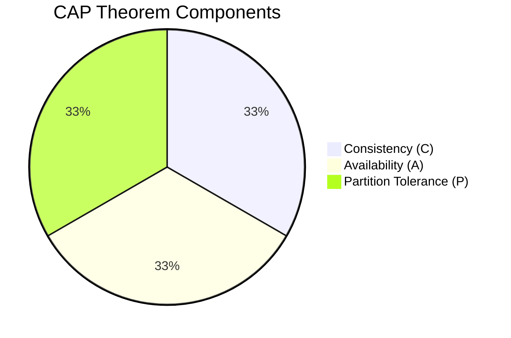

### CAP theorem

Here's a comprehensive explanation of the CAP theorem, its trade-offs, a flowchart diagram, and C# code examples to represent the different system designs (CA, CP, and AP) based on CAP principles.

---

### CAP Theorem Flowchart (Corrected)



---

### Detailed Explanation of Each Component in CAP Theorem

The CAP theorem, or Brewer's theorem, posits that a distributed data system can only provide two out of three guarantees—Consistency, Availability, and Partition Tolerance—simultaneously.

1. **Consistency (C)**:
   - Every read receives the most recent write or an error.
   - In distributed systems, maintaining consistency is crucial, especially in cases where data integrity cannot be compromised.

2. **Availability (A)**:
   - Every request (read or write) receives a response, even if it's not the most recent.
   - Availability ensures that the system continues to function and deliver data to end-users even when some nodes fail.

3. **Partition Tolerance (P)**:
   - The system continues to operate despite network partitions.
   - This is vital for modern distributed systems as network partitions are often unavoidable.

### Types of Systems in CAP Theorem

1. **CA System (Consistency & Availability)**:
   - Prioritizes data consistency and high availability.
   - Sacrifices partition tolerance, meaning that in cases of network partition, the system may stop functioning to avoid inconsistency.
   - Common in tightly-coupled systems or systems with strong consistency requirements (e.g., traditional relational databases).

2. **CP System (Consistency & Partition Tolerance)**:
   - Ensures data consistency and can tolerate network partitions.
   - Availability is sacrificed during network partition, as the system may need to delay responses until all partitions are synchronized.
   - Often used in systems requiring strong consistency, such as distributed databases with consensus mechanisms (e.g., Apache ZooKeeper, HBase).

3. **AP System (Availability & Partition Tolerance)**:
   - Prioritizes availability and tolerance to network partitions.
   - Consistency is eventually achieved, but it may be delayed—often known as "eventual consistency."
   - Frequently used in NoSQL databases designed for high availability in distributed environments (e.g., Cassandra, DynamoDB).

---

### C# Code Examples for Each System Type

Here’s how each CAP system might be represented in a simplified C# code example.

---

**1. CA System Example (Consistency & Availability)**

This example demonstrates a relational database transaction with ACID properties, where consistency and availability are prioritized but partition tolerance is sacrificed.

```csharp
using System;
using System.Data.SqlClient;

public class CA_System
{
    public void ExecuteTransaction()
    {
        using (var connection = new SqlConnection("Data Source=.;Initial Catalog=TestDB;Integrated Security=True"))
        {
            connection.Open();
            var transaction = connection.BeginTransaction();
            try
            {
                var command = new SqlCommand("INSERT INTO Users (Name) VALUES ('Alice')", connection, transaction);
                command.ExecuteNonQuery();

                command.CommandText = "UPDATE Account SET Balance = Balance - 100 WHERE UserID = 1";
                command.ExecuteNonQuery();

                transaction.Commit();
                Console.WriteLine("Transaction committed successfully.");
            }
            catch
            {
                transaction.Rollback();
                Console.WriteLine("Transaction failed and rolled back.");
            }
        }
    }
}
```

**2. CP System Example (Consistency & Partition Tolerance)**

This example simulates a consensus-based distributed system. It ensures consistency by requiring that the majority of nodes reach a consensus before proceeding.

```csharp
using System;
using System.Collections.Generic;

public class CP_System
{
    private List<string> nodes = new List<string> { "Node1", "Node2", "Node3" };
    
    public void ExecuteConsensusTransaction()
    {
        int consensusThreshold = nodes.Count / 2 + 1;
        int approvals = 0;

        foreach (var node in nodes)
        {
            Console.WriteLine($"{node} processing transaction...");
            approvals++;

            if (approvals >= consensusThreshold)
            {
                Console.WriteLine("Consensus reached. Transaction committed.");
                break;
            }
        }

        if (approvals < consensusThreshold)
        {
            Console.WriteLine("Consensus not reached. Transaction aborted.");
        }
    }
}
```

**3. AP System Example (Availability & Partition Tolerance)**

This example demonstrates a NoSQL database with eventual consistency. Data is asynchronously replicated to ensure availability and partition tolerance.

```csharp
using System;
using System.Threading.Tasks;

public class AP_System
{
    public async Task WriteDataToNoSQL(string data)
    {
        await Task.Run(() =>
        {
            Console.WriteLine("Data written to primary node.");
            Console.WriteLine("Asynchronously replicating data to other nodes...");
        });
        Console.WriteLine("Eventual consistency: Data will eventually be consistent across all nodes.");
    }
}
```

---

### Summary of CAP Theorem Trade-Offs

- **CA System**: Prioritizes Consistency and Availability, but lacks Partition Tolerance.
- **CP System**: Ensures Consistency and Partition Tolerance, sacrificing Availability under partition scenarios.
- **AP System**: Guarantees Availability and Partition Tolerance with eventual (not strict) Consistency.

Each system type addresses different needs in distributed system design, with the choice depending on the application’s requirements and tolerance for inconsistency during network partitions.
