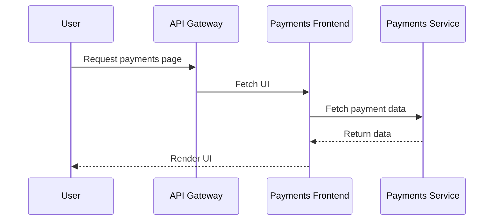

### **Designing Micro Frontends: Best Practices and Benefits**

Micro frontend architecture applies the principles of microservices to the frontend, allowing independent development, deployment, and maintenance of smaller UI components. This approach enhances scalability, enables team autonomy, and ensures modularity. Here's a detailed guide to understanding micro frontends, their benefits, and how to implement them effectively.

---

### **What is Micro Frontend Architecture?**

In a micro frontend architecture:
- The frontend is divided into smaller, self-contained components, each managed by a separate team or service.
- These components are developed and deployed independently, often corresponding to specific microservices in the backend.

**Example**:
- A **Payment Service** provides its own UI for handling payment processing.
- An **Order Service** provides a separate UI for managing orders.

---

### **Core Principles of Micro Frontends**

1. **Independence**:
   - Each frontend component should be independently developed, tested, and deployed.
   
2. **Domain-Driven Design**:
   - Components should be designed around specific business domains, mirroring the backend microservices.

3. **Decentralized Governance**:
   - Teams should have the freedom to choose the technologies and frameworks that best fit their components.

4. **Team Ownership**:
   - Each team should own the complete lifecycle of their micro frontend, from development to production.

---

### **Micro Frontend Architecture Example**

**Scenario**:
An e-commerce application consists of two primary business domains:
- **Payments**: Handles payment processing and invoicing.
- **Orders**: Manages order tracking and history.

These two domains are developed as independent micro frontends:
- **Payments Frontend**: A React-based UI that connects to the **Payments Service**.
- **Orders Frontend**: An Angular-based UI that connects to the **Orders Service**.

**Implementation Flow**:
1. A user requests the payments page via an **API Gateway**.
2. The API Gateway routes the request to the Payments Frontend.
3. The Payments Frontend retrieves data from the Payments Service and renders the UI.

**Mermaid Sequence Diagram**:

---

### **Benefits of Micro Frontends**

1. **Scalability**:
   - Teams can work on different frontend components in parallel, speeding up development.
   
2. **Technology Agnosticism**:
   - Each team can choose the best tools and frameworks for their frontend components.

3. **Independent Deployment**:
   - Updates to one micro frontend do not affect the others, reducing deployment risks.

4. **Improved Maintainability**:
   - Smaller, focused components are easier to maintain and test.

5. **Better Team Autonomy**:
   - Teams can operate independently without stepping on each other’s toes.

---

### **Key Practices for Designing Micro Frontends**

1. **Independent Codebases**:
   - Each micro frontend should have its own repository and build pipeline.

2. **Domain Alignment**:
   - Design micro frontends around specific business capabilities, mirroring the backend.

3. **Use API Gateways**:
   - Employ an API Gateway to handle routing and communication between micro frontends and their backend services.

4. **Shared Design System**:
   - Use a shared library for UI components to ensure consistent look and feel.

5. **Deploy Independently**:
   - Use containerization (e.g., Docker) to deploy each micro frontend separately.

6. **Avoid Tight Coupling**:
   - Minimize dependencies between micro frontends to prevent cascading failures.

---

### **Comparison Table: Monolithic Frontend vs Micro Frontend**

| **Aspect**               | **Monolithic Frontend**                         | **Micro Frontend**                            |
|--------------------------|------------------------------------------------|-----------------------------------------------|
| **Codebase**             | Single codebase                                | Multiple independent codebases                |
| **Scalability**          | Limited, as teams work on a shared codebase    | High, as teams work on independent components |
| **Deployment**           | Full application redeployed for every update   | Independent deployment for each component     |
| **Technology Stack**     | Single stack for the entire application        | Teams can choose their own stack              |
| **Team Ownership**       | Shared ownership                               | Full ownership of individual components       |
| **Fault Isolation**      | Errors in one part can affect the whole app    | Errors are isolated to the specific component |

---

### **Implementation Flow**

**Step 1**: **Design Component Boundaries**
- Identify distinct business domains and align frontend components with them.

**Step 2**: **Develop Independent Components**
- Each team develops its frontend independently using its preferred stack.

**Step 3**: **Integrate with API Gateway**
- Use an API Gateway to manage routing between the user and frontend components.

**Step 4**: **Ensure Consistent UI**
- Use shared libraries or a design system to ensure visual consistency.

**Step 5**: **Deploy Separately**
- Deploy each frontend as a separate service using containers or serverless platforms.

---

### **Example Use Case**

**E-Commerce Platform**:
- **Payments Frontend**:
  - Provides a React-based interface for payment processing.
  - Communicates with the Payments Service for billing and invoicing.
- **Orders Frontend**:
  - Provides an Angular-based interface for order tracking.
  - Fetches order details from the Orders Service.

---

### **Challenges and Solutions**

| **Challenge**                     | **Solution**                                                                      |
|-----------------------------------|-----------------------------------------------------------------------------------|
| Ensuring consistent UI/UX         | Use a shared design system or component library.                                  |
| Communication between frontends   | Employ an API Gateway to route requests and handle communication.                 |
| Managing multiple codebases       | Use automated CI/CD pipelines for streamlined builds and deployments.             |
| Cross-cutting concerns (e.g., auth)| Centralize concerns like authentication using middleware in the API Gateway.      |

---

### **Conclusion**

Micro frontends enable teams to build scalable, modular, and maintainable frontend architectures by dividing the frontend into smaller, independently deployable units. By adopting best practices like independent codebases, API gateways, and domain alignment, organizations can unlock greater efficiency, flexibility, and team autonomy in their frontend development processes.
