### How to Improve API Performance?

The following are five common techniques to optimize API performance and their explanations in English:

---

### **1. Pagination**
- **Principle**: Divide large result sets into smaller pages and return them incrementally to the client.
- **Advantages**:
  - Enhances service responsiveness by avoiding a single large payload.
  - Allows clients to load data progressively, improving user experience.

---

### **2. Asynchronous Logging**
- **Principle**: Instead of synchronous logging, which interacts with the disk for every call, use asynchronous logging to write logs into a lock-free buffer and flush them to the disk periodically.
- **Advantages**:
  - Reduces the overhead of I/O operations.
  - Increases system throughput, especially in high-concurrency scenarios.

---

### **3. Caching**
- **Principle**: Store frequently accessed data in a cache. The client queries the cache first and falls back to the database if the cache misses.
- **Advantages**:
  - Cache systems like Redis provide in-memory data storage, making data access significantly faster than database queries.
  - Reduces database load and improves system responsiveness.

---

### **4. Payload Compression**
- **Principle**: Compress requests and responses (e.g., using gzip) to reduce data size for transmission.
- **Advantages**:
  - Minimizes network bandwidth usage.
  - Speeds up data uploads and downloads.

---

### **5. Connection Pool**
- **Principle**: Use a pool of pre-opened database connections to reduce the overhead of repeatedly opening and closing connections.
- **Advantages**:
  - Lowers the time spent on connection establishment and teardown.
  - Improves resource utilization through connection reuse.

---

### Sequence Diagram for Improving API Performance

The diagram below illustrates these techniques step by step, with flow numbers for clarity.

```mermaid
sequenceDiagram
    autonumber

    participant Client 🖥️
    participant API Service 🔧
    participant Buffer 💾
    participant Disk 📀
    participant Cache 🗃️
    participant Database 🗄️

    %% Pagination
    Client 🖥️->>+API Service 🔧: Request data (1️⃣)
    API Service 🔧->>API Service 🔧: Perform pagination (2️⃣)
    API Service 🔧-->>-Client 🖥️: Return paged data (3️⃣)

    %% Asynchronous Logging
    API Service 🔧->>+Buffer 💾: Log asynchronously (4️⃣)
    Buffer 💾->>Disk 📀: Periodically flush logs (5️⃣)

    %% Caching
    Client 🖥️->>+API Service 🔧: Request resource (6️⃣)
    API Service 🔧->>Cache 🗃️: Check cache (7️⃣)
    alt Cache Hit
        Cache 🗃️-->>API Service 🔧: Return cached data (8️⃣)
        API Service 🔧-->>Client 🖥️: Return result (9️⃣)
    else Cache Miss
        API Service 🔧->>+Database 🗄️: Query database (🔟)
        Database 🗄️-->>API Service 🔧: Return data (1️⃣1️⃣)
        API Service 🔧->>Cache 🗃️: Update cache (1️⃣2️⃣)
        API Service 🔧-->>Client 🖥️: Return result (1️⃣3️⃣)
    end

    %% Payload Compression
    Client 🖥️->>+API Service 🔧: Send request (1️⃣4️⃣)
    API Service 🔧->>API Service 🔧: Compress data (1️⃣5️⃣)
    API Service 🔧-->>Client 🖥️: Return compressed response (1️⃣6️⃣)

    %% Connection Pool
    API Service 🔧->>+Database 🗄️: Use pooled connection to query data (1️⃣7️⃣)
    Database 🗄️-->>API Service 🔧: Return query result (1️⃣8️⃣)
```

---

### Explanation of the Diagram

1. **Flow Numbers**:
   - Each optimization step is assigned a flow number for easy reference.

2. **Techniques Highlighted**:
   - **Pagination**: Handles large datasets by breaking them into pages.
   - **Asynchronous Logging**: Reduces disk I/O overhead by buffering logs.
   - **Caching**: Speeds up response times by reducing database dependency.
   - **Payload Compression**: Improves bandwidth efficiency.
   - **Connection Pool**: Reuses database connections to lower overhead.

3. **Visual Elements**:
   - Emojis clarify roles: 🖥️ (Client), 🔧 (API Service), 💾 (Buffer), 📀 (Disk), 🗃️ (Cache), and 🗄️ (Database).

---

### Graph Representation of Optimizations

---

### Summary

To improve API performance:
1. **Pagination**: Use for large result sets.
2. **Asynchronous Logging**: Ideal for high-concurrency systems.
3. **Caching**: Perfect for frequent data access.
4. **Payload Compression**: Best for high data transmission.
5. **Connection Pool**: Efficient for database-heavy operations.

These techniques ensure better performance, lower resource usage, and improved user experience.
