### **Key Design Patterns**

Design patterns are **reusable solutions** to common design challenges in software development. They serve as blueprints that streamline development processes, improve code organization, and promote best practices. Below is a detailed explanation of 18 key design patterns, categorized by their purpose, along with **Mermaid sequence diagrams** to illustrate their workflows.

---

### **1. Abstract Factory: Family Creator**

**Purpose**: Creates families of related objects without specifying their concrete classes.

**How It Works**:
1. A client requests an abstract factory to produce related objects.
2. Concrete factories implement the abstract factory interface to create specific products.

**Mermaid Sequence Diagram**:
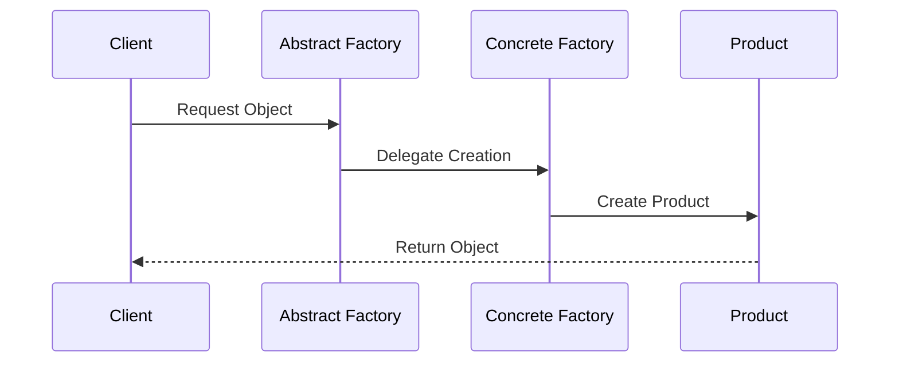

---

### **2. Builder: Lego Master**

**Purpose**: Constructs complex objects step by step, separating the creation process from the object's representation.

**How It Works**:
1. The client requests the director to build an object.
2. The director guides the builder through the construction steps.

**Mermaid Sequence Diagram**:
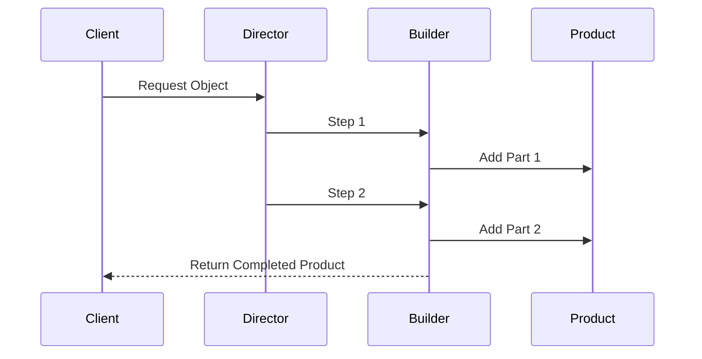

---

### **3. Prototype: Clone Maker**

**Purpose**: Creates new objects by cloning existing ones.

**How It Works**:
1. The client clones a prototype object instead of creating a new one.
2. The prototype is copied to produce a new object.

**Mermaid Sequence Diagram**:
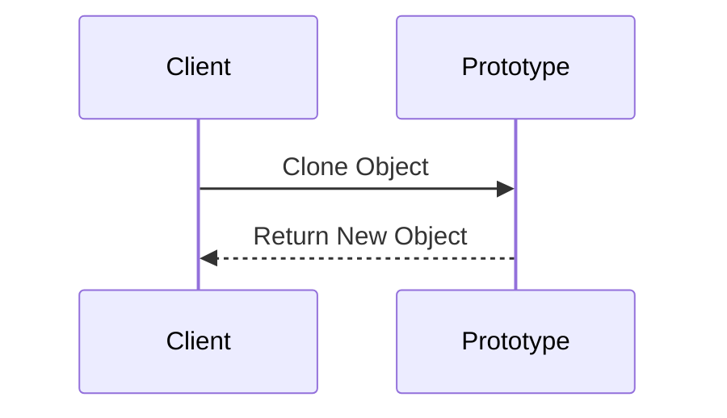

---

### **4. Singleton: One and Only**

**Purpose**: Ensures a class has only one instance and provides a global access point.

**How It Works**:
1. The client checks if the singleton instance exists.
2. If not, a new instance is created and returned.

**Mermaid Sequence Diagram**:
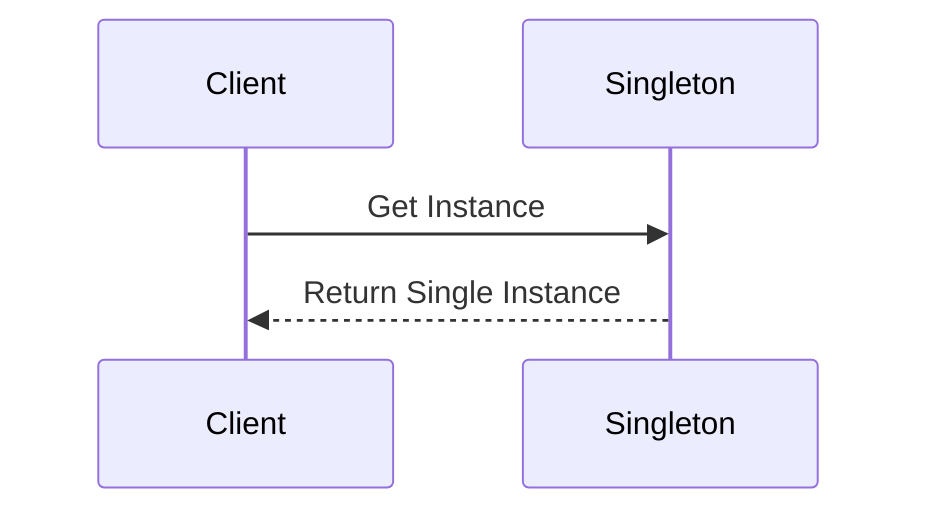

---

### **5. Adapter: Universal Plug**

**Purpose**: Converts the interface of one class to another.

**How It Works**:
1. The client uses an adapter to work with an incompatible interface.
2. The adapter translates requests to the target interface.

**Mermaid Sequence Diagram**:
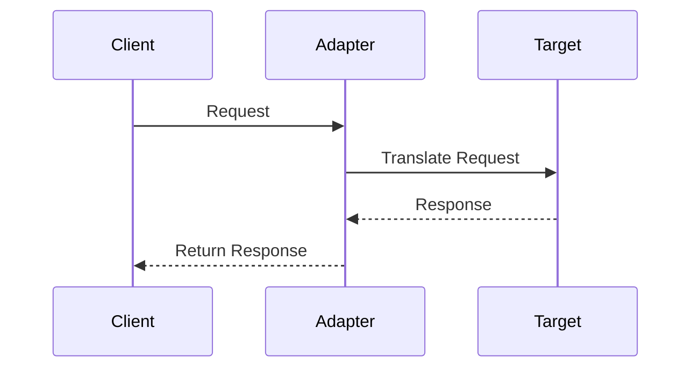

---

### **6. Bridge: Function Connector**

**Purpose**: Separates an object’s interface from its implementation.

**How It Works**:
1. The client interacts with the abstraction layer.
2. The abstraction delegates work to the implementation.

**Mermaid Sequence Diagram**:
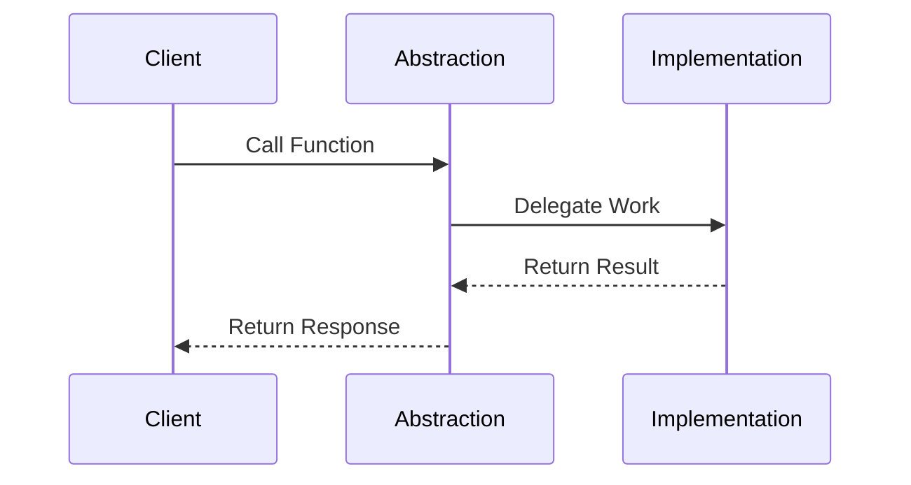

---

### **7. Composite: Tree Builder**

**Purpose**: Creates tree-like structures of simple and composite objects.

**How It Works**:
1. The client interacts with objects uniformly, regardless of whether they are simple or composite.

**Mermaid Sequence Diagram**:
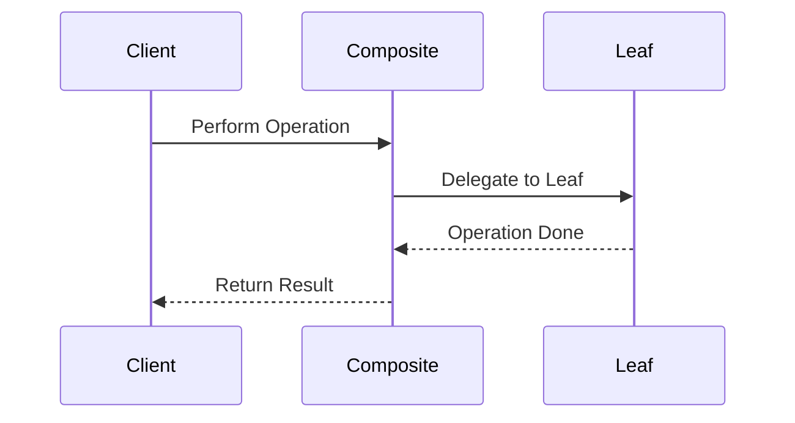

---

### **8. Decorator: Customizer**

**Purpose**: Dynamically adds features to objects without changing their core implementation.

**How It Works**:
1. The client wraps an object with decorators to add features.

**Mermaid Sequence Diagram**:
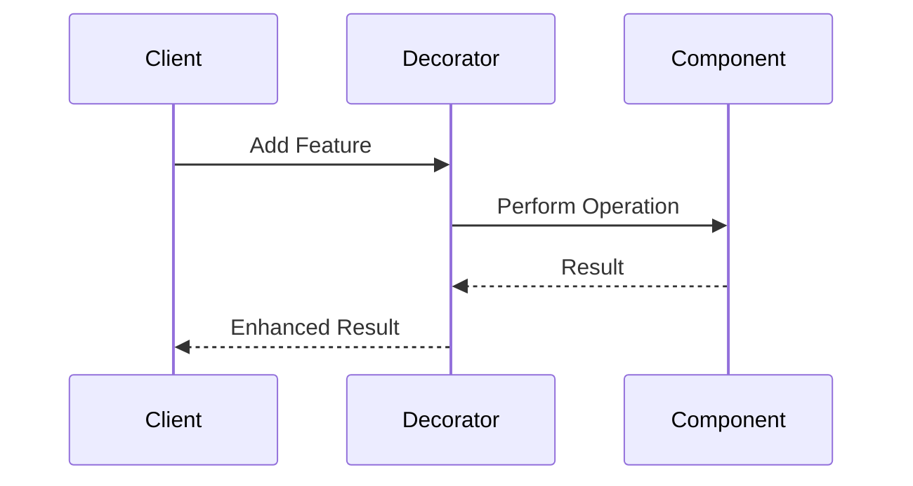

---

### **9. Facade: One-Stop-Shop**

**Purpose**: Provides a simplified interface to a complex subsystem.

**How It Works**:
1. The client interacts with the facade instead of directly accessing subsystem components.

**Mermaid Sequence Diagram**:
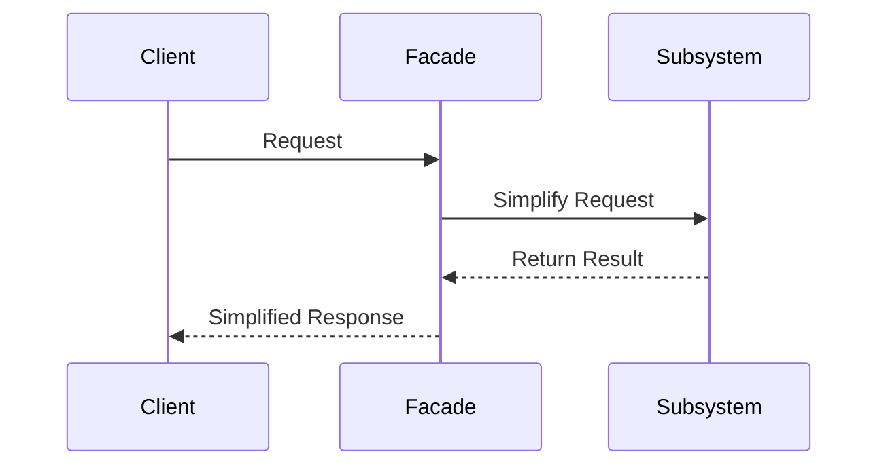

---

### **10. Flyweight: Space Saver**

**Purpose**: Shares small, reusable objects to save memory.

**How It Works**:
1. The client requests a shared flyweight object from a factory.
2. The factory returns an existing object or creates a new one if needed.

**Mermaid Sequence Diagram**:
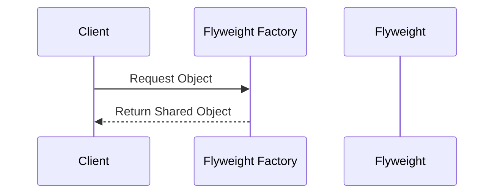

---

### **11. Proxy: Stand-In Actor**

**Purpose**: Acts as a placeholder or proxy for another object.

**How It Works**:
1. The client interacts with the proxy, which controls access to the real object.

**Mermaid Sequence Diagram**:
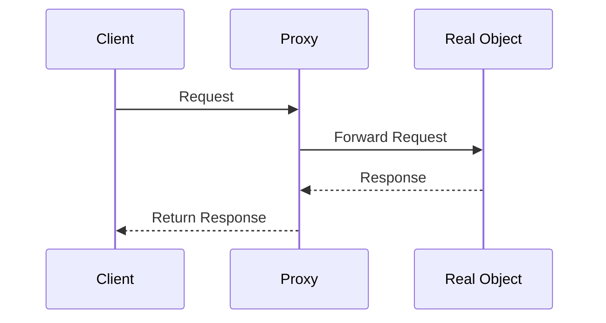

---

### **12. Chain of Responsibility: Request Relay**

**Purpose**: Passes a request along a chain of handlers until it is handled.

**How It Works**:
1. The client sends a request to the first handler in the chain.
2. Each handler processes or forwards the request.

**Mermaid Sequence Diagram**:
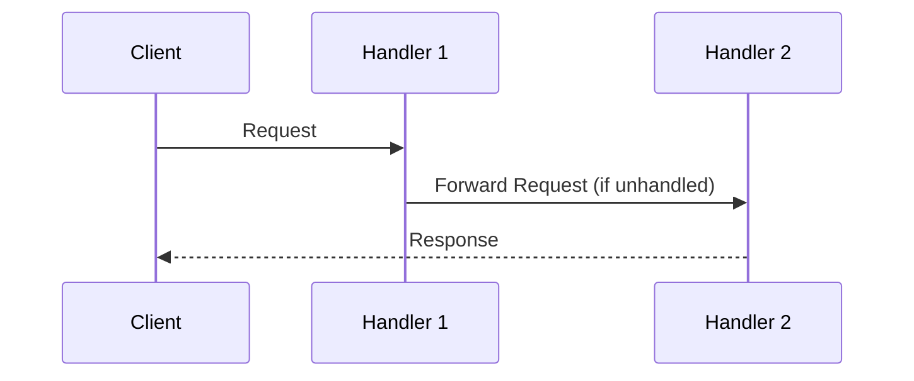

---

### **Conclusion**

These 18 design patterns are fundamental tools for building efficient, reusable, and maintainable software systems. By understanding their purposes and workflows, developers can address common design challenges with proven solutions. Each pattern offers a specific way to improve the software structure, whether it's simplifying interactions, optimizing memory usage, or enhancing modularity.
