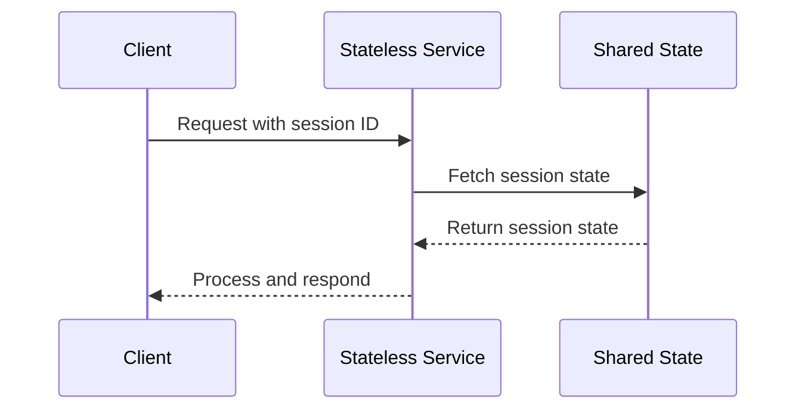
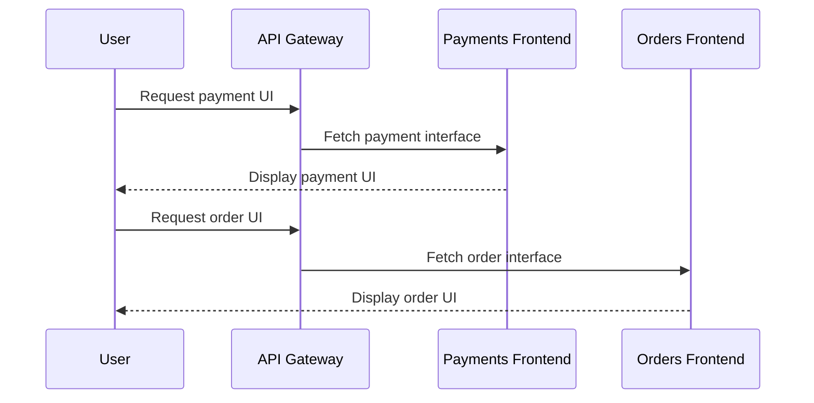

### **Microservice Best Practices: A Comprehensive Guide**

Microservices architecture is a widely adopted approach to build scalable and maintainable software systems. To maximize the benefits of this architecture, following best practices is crucial. Below are the **9 key best practices** for developing microservices, along with explanations, benefits, and visual references.

---

### **1. Separate Data Storage for Each Microservice**

- **Description**: Each microservice should manage its own data storage, ensuring complete isolation and independence from other services.
- **Benefits**:
  - Reduces coupling between services.
  - Allows each service to choose the database technology best suited to its needs.
  - Improves fault isolation.

**Example**:
- **Service A** uses a relational database (e.g., MySQL).
- **Service B** uses a NoSQL database (e.g., MongoDB).

---

### **2. Keep Code at a Similar Level of Maturity**

- **Description**: Maintain all microservices at a similar level of code maturity to avoid dependencies on outdated or unstable services.
- **Benefits**:
  - Ensures compatibility between services.
  - Reduces technical debt and inconsistencies.

**Example**:
- **Service A** and **Service C** are at Level 3 maturity, while **Service B** is more advanced at Level 4.

---

### **3. Separate Build for Each Microservice**

- **Description**: Each microservice should have its own build pipeline, allowing independent testing, building, and deployment.
- **Benefits**:
  - Faster and more efficient CI/CD pipelines.
  - Prevents one service's issues from affecting others.

**Example**:
- Independent build pipelines ensure **Service A**, **Service B**, and **Service C** can be deployed without waiting on each other.

---

### **4. Assign Each Microservice with a Single Responsibility**

- **Description**: Each microservice should focus on one specific task or domain, adhering to the **Single Responsibility Principle (SRP)**.
- **Benefits**:
  - Simplifies codebase and improves maintainability.
  - Makes services easier to test, deploy, and scale independently.

**Example**:
- A microservice responsible for processing payments should not handle user authentication.

---

### **5. Deploy into Containers**

- **Description**: Deploy microservices in containers (e.g., Docker) to ensure consistency across environments.
- **Benefits**:
  - Simplifies deployment and scaling.
  - Isolates microservices, preventing conflicts.
  - Portable across development, staging, and production environments.

**Example**:
- Each service (e.g., **Service A**, **Service B**) is containerized and deployed with its dependencies.

---

### **6. Design Stateless Services**

- **Description**: Microservices should be stateless, meaning they do not store session data on the server. All session-related information should be stored in a shared state (e.g., database or cache).
- **Benefits**:
  - Improves scalability.
  - Simplifies failover and recovery processes.

**Example**:
- Each request to a service is independent, allowing services to be distributed across multiple servers.

**Sequence Diagram**:

---

### **7. Adopt Domain-Driven Design (DDD)**

- **Description**: Use **domain-driven design** to ensure microservices are organized around business domains and not technical concerns.
- **Benefits**:
  - Aligns microservices with business capabilities.
  - Encourages clear boundaries between services.

**Example**:
- Payment services, order services, and inventory services are designed around distinct business domains.

---

### **8. Design Micro Frontend**

- **Description**: Use micro frontends to divide the frontend layer into smaller, independent parts that correspond to different microservices.
- **Benefits**:
  - Allows teams to independently develop and deploy frontend components.
  - Encourages reuse of UI components across projects.

**Example**:
- A payment microservice provides its own frontend for payment processing, while an order microservice provides a separate order management interface.

**Sequence Diagram**:

---

### **9. Orchestrating Microservices**

- **Description**: Use orchestration tools (e.g., Kubernetes) to manage and deploy microservices in a scalable and reliable way.
- **Benefits**:
  - Automates deployment, scaling, and monitoring.
  - Ensures high availability and fault tolerance.

**Example**:
- A Kubernetes cluster manages multiple services (**Service A**, **Service B**, **Service C**) distributed across different nodes.

---

### **Best Practices Comparison Table**

| **Practice**                     | **Description**                                                                 | **Benefits**                                      | **Example**                                       |
|-----------------------------------|---------------------------------------------------------------------------------|--------------------------------------------------|--------------------------------------------------|
| Separate Data Storage             | Each service manages its own data store.                                        | Reduces coupling, improves fault isolation.      | Relational DB for Service A, NoSQL for Service B |
| Code Maturity                     | Keep services at similar code maturity levels.                                  | Ensures compatibility, reduces technical debt.   | Services at Level 3 and Level 4 maturity         |
| Separate Build                    | Independent build pipelines for each service.                                   | Faster deployment cycles, avoids inter-service issues. | Separate pipelines for Service A and Service B  |
| Single Responsibility             | Each service focuses on one task/domain.                                        | Simplifies maintenance, improves scalability.    | Payment service only processes payments          |
| Deploy into Containers            | Use containers to isolate and deploy services.                                  | Simplifies portability and scaling.             | Dockerized microservices                         |
| Stateless Services                | Avoid storing session data on the server.                                       | Enhances scalability and failover.              | Stateless API with session IDs                  |
| Domain-Driven Design              | Organize services around business domains.                                      | Clear boundaries, aligns with business logic.    | Payment, order, and inventory services           |
| Micro Frontend                    | Split frontend by microservice functionality.                                   | Independent development and deployment.          | Payment UI and Order UI                          |
| Orchestrating Microservices       | Use tools like Kubernetes to manage services.                                   | Automates scaling and ensures reliability.       | Kubernetes managing Service A and Service B      |

---

### **Conclusion**

By following these 9 best practices, teams can design scalable, maintainable, and efficient microservices architectures. From isolating data stores to adopting domain-driven design, each practice contributes to building a robust system capable of handling complex business requirements. Incorporating orchestration tools and micro frontends further enhances the scalability and modularity of the application.
