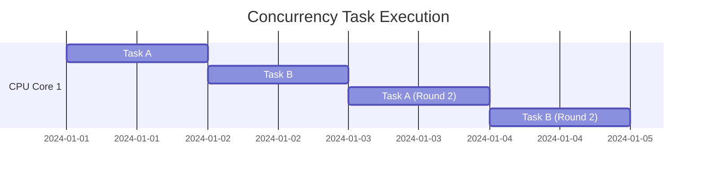
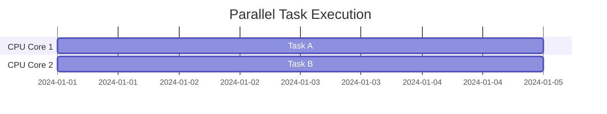
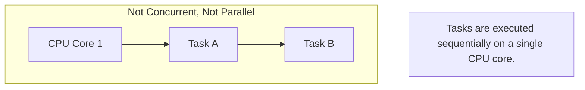
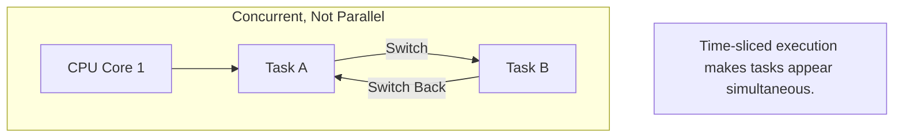
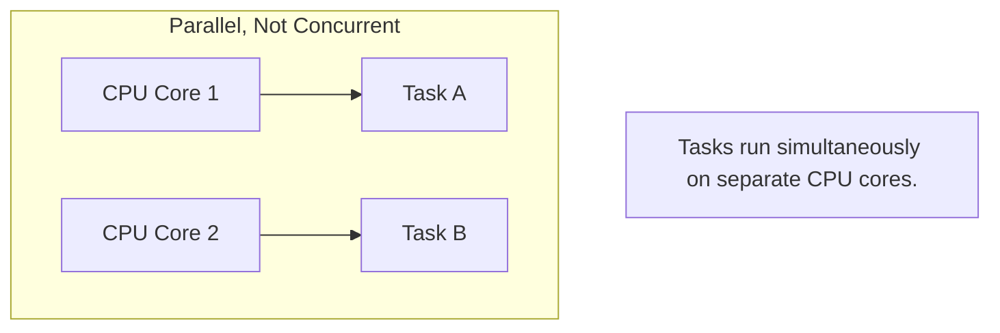
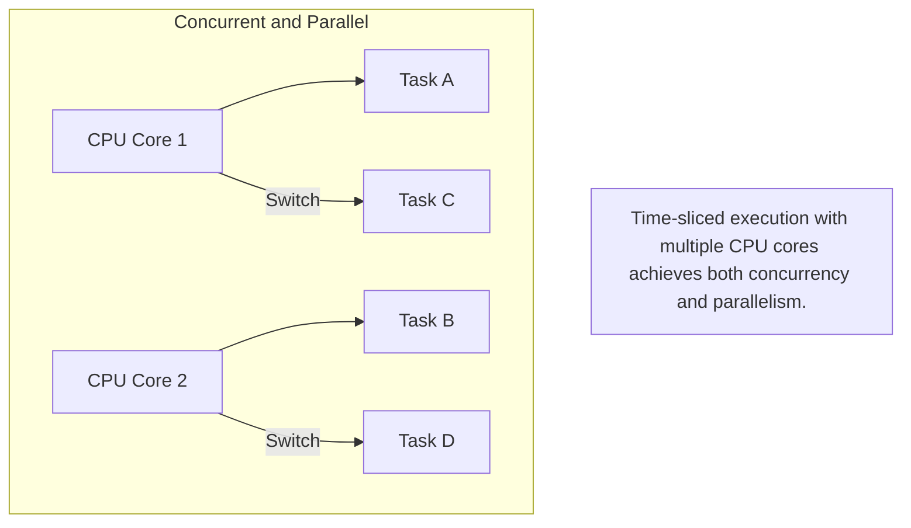

### **Parallelism vs Concurrency**

Parallelism and concurrency are fundamental concepts in computer science, often used to describe how tasks are executed. While related, they differ significantly in their implementation and application.

---

### **Key Differences**

| **Feature**         | **Parallelism**                                        | **Concurrency**                                     |
|----------------------|-------------------------------------------------------|----------------------------------------------------|
| **Definition**       | Multiple tasks executed **simultaneously**, leveraging multi-core CPUs. | Multiple tasks executed **interleaved**, appearing simultaneous. |
| **Task Distribution**| Tasks are distributed across multiple CPU cores, running at the same time. | Tasks switch rapidly on single or multiple CPU cores. |
| **Hardware Dependency**| Requires multi-core or multiple CPUs.               | Does not depend on multi-core hardware, just task scheduling. |
| **Goal**            | Increase throughput and reduce execution time.         | Improve task responsiveness and switching efficiency. |
| **Example**          | Running multiple scientific computations simultaneously. | Loading multiple web pages concurrently in a browser. |

---

### **1. Parallelism**

- **Characteristics**: True simultaneous execution of multiple tasks.
- **Implementation**: Requires multi-core CPUs with tasks assigned to different cores.
- **Scenario**: Best for CPU-intensive tasks like big data computation or simulations.
- **Analogy**: Two people (two CPU cores) lifting two stones simultaneously.

---

### **2. Concurrency**

- **Characteristics**: Tasks alternate execution, appearing to run simultaneously.
- **Implementation**: Achieved through time slicing and operating system scheduling.
- **Scenario**: Best for I/O-intensive tasks like network requests or file reading.
- **Analogy**: One person (single CPU core) switching between lifting two stones quickly, creating an illusion of simultaneity.

---

### **Illustrations: Parallelism vs Concurrency**

#### **Figure 1: Concurrency**

**Explanation**:
- A single CPU core alternates execution between Task A and Task B.
- Only one task runs at a time.

---

#### **Figure 2: Parallelism**

**Explanation**:
- Two CPU cores execute Task A and Task B independently.
- Both tasks truly run at the same time without interference.

---

### **Use Cases**

| **Scenario**            | **Parallelism**                          | **Concurrency**                        |
|--------------------------|------------------------------------------|----------------------------------------|
| **Scientific Computing** | Yes                                     | No                                     |
| **Web Servers**          | Yes                                     | Yes                                    |
| **File Downloading**     | No                                      | Yes                                    |
| **High-Performance Computing** | Yes                               | No                                     |

---

### **Summary**

1. **Parallelism** is hardware-level simultaneity, while **concurrency** is logic-level simultaneity.
2. Parallelism offers higher efficiency but depends on hardware, whereas concurrency optimizes responsiveness.
3. Choose the appropriate model based on the system's needs and performance requirements.

---

### **Detailed Flowchart Comparisons**

#### **Case 1: Not Concurrent, Not Parallel**

#### **Case 2: Concurrent, Not Parallel**

#### **Case 3: Parallel, Not Concurrent**

#### **Case 4: Concurrent and Parallel**

