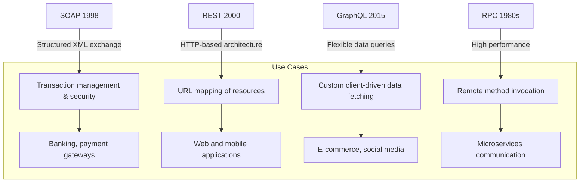

### SOAP vs REST vs GraphQL vs RPC

Below is an explanation of the API timeline and a comparison of different API architectural styles. Each style has distinct standards for data exchange and use cases, which have evolved over time.

---

#### **1. SOAP (Simple Object Access Protocol)**
- **Introduced**: 1998
- **Key Features**:
  - XML-based protocol designed for structured data exchange.
  - Strongly typed, with strict message format and built-in security (e.g., WS-Security).
  - Supports transaction management and ACID properties.
- **Use Cases**:
  - Enterprise-grade applications requiring strong consistency and complex operations.
  - Banking systems, payment gateways, and other security-critical services.
- **Drawbacks**:
  - Heavy and slow due to verbose XML messages and high parsing overhead.

---

#### **2. REST (Representational State Transfer)**
- **Introduced**: 2000
- **Key Features**:
  - Based on HTTP protocols and resources are accessed using standard URLs.
  - Supports multiple formats for data exchange, with JSON being the most common.
  - Stateless architecture: each request is independent.
- **Use Cases**:
  - Web and mobile applications with rapid development needs.
  - Public APIs, like social media or mapping services.
- **Drawbacks**:
  - Requires multiple calls for complex data, potentially leading to inefficiencies.

---

#### **3. GraphQL**
- **Introduced**: 2015
- **Key Features**:
  - Developed by Facebook, focuses on flexible querying and retrieving exactly the required data.
  - Uses a single endpoint and supports schema-based queries for multiple related entities.
  - Avoids over-fetching or under-fetching data, unlike REST.
- **Use Cases**:
  - Applications with dynamic front-end needs, like social media platforms or e-commerce websites.
  - Highly interactive apps with complex relationships between entities.
- **Drawbacks**:
  - Steeper learning curve than REST.
  - Requires additional work for performance optimization and caching.

---

#### **4. RPC (Remote Procedure Call)**
- **Introduced**: Originated in the 1980s, before SOAP.
- **Key Features**:
  - Enables remote method invocation as if they were local procedures.
  - Modern implementations, like gRPC, use lightweight and efficient serialization formats like Protocol Buffers.
  - High performance and low latency, especially for inter-service communication.
- **Use Cases**:
  - Microservices architecture.
  - Internal service-to-service communication requiring minimal overhead.
- **Drawbacks**:
  - Less human-readable compared to REST, making debugging more difficult.

---

### **Comparison Diagram**



---

### **Summary**
1. **SOAP** is ideal for enterprise-level use cases requiring high security and transactional support.
2. **REST** is the most versatile and widely adopted style, suitable for the majority of web and mobile applications.
3. **GraphQL** offers fine-grained control and flexibility, making it suitable for dynamic front-end applications.
4. **RPC** is optimized for high-performance internal communications in microservices architectures.

---

### Using C# Code to Demonstrate Choosing the Right API Style

The following examples show how to use C# to demonstrate four common API styles: **SOAP**, **REST**, **GraphQL**, and **RPC**. By selecting the appropriate API style based on specific business needs, you can optimize system performance and improve development efficiency.

---

#### 1. SOAP Example: For High Security and Transactional Needs

```csharp
using System;
using System.ServiceModel;

[ServiceContract]
public interface ISoapService
{
    [OperationContract]
    string ProcessPayment(string transactionId);
}

public class SoapService : ISoapService
{
    public string ProcessPayment(string transactionId)
    {
        // Simulate secure transaction processing
        return $"Transaction {transactionId} processed securely.";
    }
}

class SoapClientDemo
{
    public void Run()
    {
        ChannelFactory<ISoapService> factory = new ChannelFactory<ISoapService>(
            new BasicHttpBinding(),
            new EndpointAddress("http://localhost/soapService")
        );

        ISoapService client = factory.CreateChannel();
        string response = client.ProcessPayment("TX12345");
        Console.WriteLine(response);
    }
}
```

---

#### 2. REST Example: Suitable for Most Web and Mobile Applications

```csharp
using System;
using System.Net.Http;
using System.Threading.Tasks;

class RestClientDemo
{
    public async Task Run()
    {
        using HttpClient client = new HttpClient();
        HttpResponseMessage response = await client.GetAsync("http://localhost/api/resource");
        string data = await response.Content.ReadAsStringAsync();
        Console.WriteLine($"Received data: {data}");
    }
}
```

---

#### 3. GraphQL Example: For Flexible Front-End Data Requirements

```csharp
using System;
using System.Net.Http;
using System.Text;
using System.Threading.Tasks;

class GraphQLClientDemo
{
    public async Task Run()
    {
        using HttpClient client = new HttpClient();
        var query = new
        {
            query = "{ product(id: \"1\") { id name price } }"
        };

        string jsonQuery = System.Text.Json.JsonSerializer.Serialize(query);
        StringContent content = new StringContent(jsonQuery, Encoding.UTF8, "application/json");

        HttpResponseMessage response = await client.PostAsync("http://localhost/graphql", content);
        string data = await response.Content.ReadAsStringAsync();
        Console.WriteLine($"GraphQL Response: {data}");
    }
}
```

---

#### 4. RPC Example: For High-Performance Communication Between Microservices

```csharp
using Grpc.Net.Client;
using System;
using System.Threading.Tasks;

// Define RPC service interface
public class RpcClientDemo
{
    public async Task Run()
    {
        using var channel = GrpcChannel.ForAddress("http://localhost:5000");
        var client = new RpcService.RpcServiceClient(channel);
        
        var request = new ProcessRequest { TransactionId = "TX12345" };
        var response = await client.ProcessTransactionAsync(request);
        Console.WriteLine($"RPC Response: {response.Message}");
    }
}
```

---

### Comprehensive Example of Choosing an API Style

The following code demonstrates selecting an API style based on specific business needs.

```csharp
class Program
{
    static async Task Main(string[] args)
    {
        Console.WriteLine("Select API Style: 1=SOAP, 2=REST, 3=GraphQL, 4=RPC");
        string choice = Console.ReadLine();

        switch (choice)
        {
            case "1":
                var soapClient = new SoapClientDemo();
                soapClient.Run();
                break;
            case "2":
                var restClient = new RestClientDemo();
                await restClient.Run();
                break;
            case "3":
                var graphQLClient = new GraphQLClientDemo();
                await graphQLClient.Run();
                break;
            case "4":
                var rpcClient = new RpcClientDemo();
                await rpcClient.Run();
                break;
            default:
                Console.WriteLine("Invalid choice.");
                break;
        }
    }
}
```

---

### Summary

1. **SOAP**: Suitable for scenarios requiring high security and strong transactional capabilities, such as payment systems.
2. **REST**: General-purpose, suitable for most web and mobile applications.
3. **GraphQL**: Flexible, ideal for front-end development with dynamic and complex data requirements.
4. **RPC**: High-performance, used for efficient communication between microservices.

With these examples, you can select the API style that best fits your specific business requirements, optimizing system performance and improving development efficiency.
