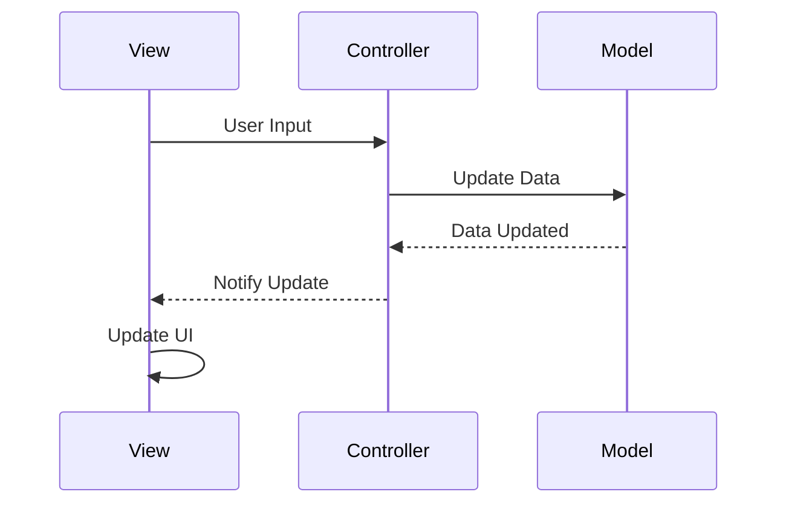
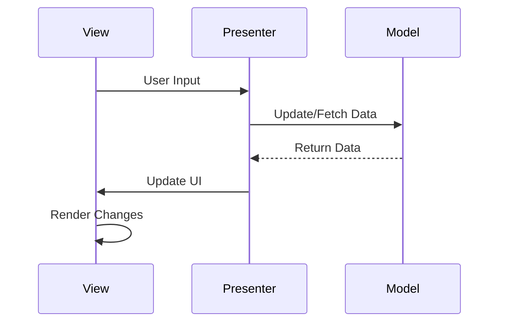
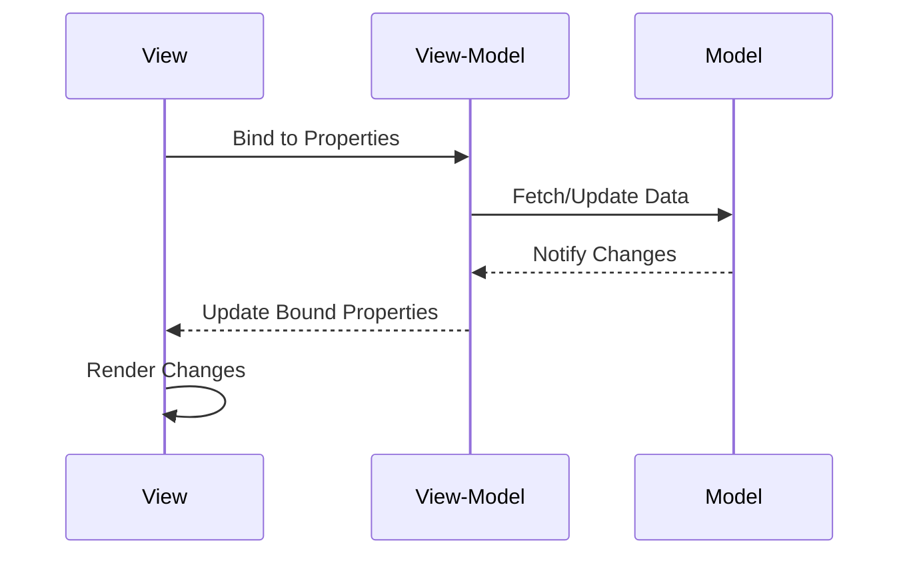
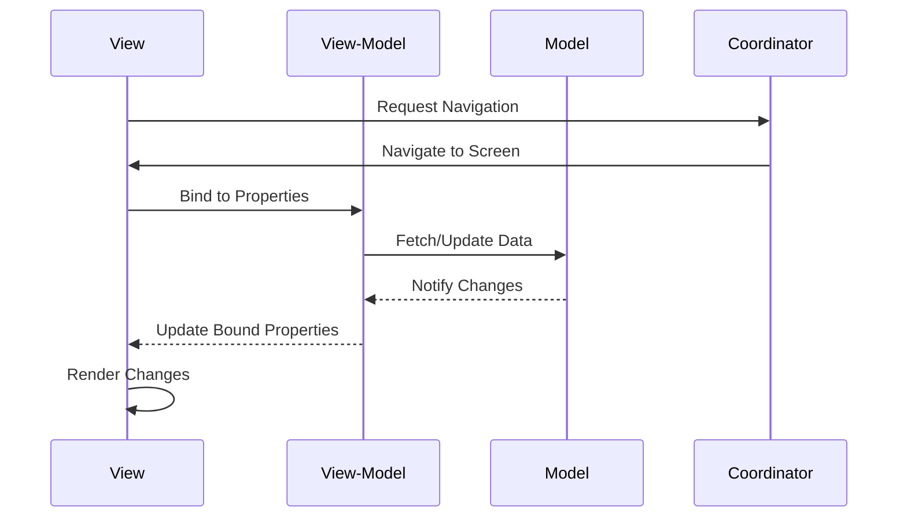
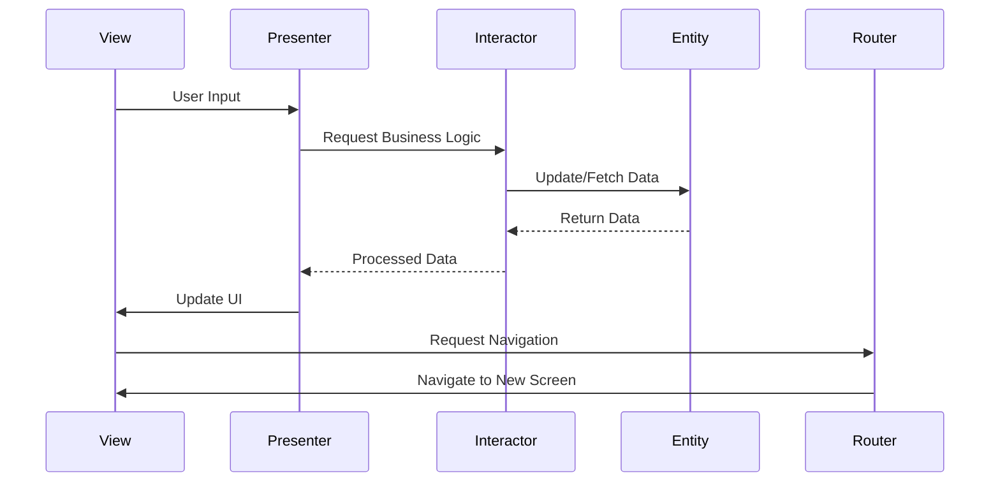

### **Understanding Architecture Patterns: MVC, MVP, MVVM, MVVM-C, and VIPER**

Modern app development relies on architecture patterns to manage code complexity, enhance scalability, and improve maintainability. Patterns like **MVC**, **MVP**, **MVVM**, **MVVM-C**, and **VIPER** have become standard solutions for iOS and Android developers. Here’s a detailed breakdown of each architecture pattern, including its components, how it works, and a **Mermaid sequence diagram** to illustrate the flow.

---

### **1. Model-View-Controller (MVC)**

**Components**:
- **Model**: Manages business data and logic.
- **View**: Displays content and handles user input.
- **Controller**: Mediates between the view and the model.

**How It Works**:
1. The **view** sends user input to the **controller**.
2. The **controller** processes the input and updates the **model**.
3. The **model** notifies the **view** of data changes.
4. The **view** updates the UI.

**Mermaid Sequence Diagram**:

---

### **2. Model-View-Presenter (MVP)**

**Components**:
- **Model**: Manages business data and logic.
- **View**: Handles UI rendering and user interactions.
- **Presenter**: Acts as a middleman, handling all business logic and updating the view.

**How It Works**:
1. The **view** sends user input to the **presenter**.
2. The **presenter** updates the **model** or fetches data from it.
3. The **presenter** updates the **view** with the processed data.

**Mermaid Sequence Diagram**:

---

### **3. Model-View-ViewModel (MVVM)**

**Components**:
- **Model**: Manages business data and logic.
- **View**: Binds to the **view-model** and displays data.
- **View-Model**: Exposes data and commands to the **view**, acting as a bridge between the **model** and the **view**.

**How It Works**:
1. The **view** binds to properties in the **view-model**.
2. The **view-model** updates the **model** or fetches data from it.
3. Changes in the **model** automatically update the **view** through the **view-model** using data binding.

**Mermaid Sequence Diagram**:

---

### **4. Model-View-ViewModel with Coordinator (MVVM-C)**

**Components**:
- **Model**: Same as MVVM.
- **View**: Same as MVVM.
- **View-Model**: Same as MVVM but without navigation responsibilities.
- **Coordinator**: Handles navigation and screen transitions.

**How It Works**:
1. The **coordinator** manages navigation and screen transitions.
2. The **view** binds to the **view-model** for data.
3. The **view-model** interacts with the **model** to fetch or update data.
4. Navigation events are handled by the **coordinator**.

**Mermaid Sequence Diagram**:

---

### **5. View-Interactor-Presenter-Entity-Router (VIPER)**

**Components**:
- **View**: Displays UI and handles user input.
- **Interactor**: Handles business logic and interacts with the **entity**.
- **Presenter**: Connects the **view** and the **interactor**.
- **Entity**: The data layer representing the business model.
- **Router**: Manages navigation.

**How It Works**:
1. The **view** passes user input to the **presenter**.
2. The **presenter** delegates business logic to the **interactor**.
3. The **interactor** updates or retrieves data from the **entity**.
4. The **presenter** updates the **view** with data.
5. The **router** handles navigation between screens.

**Mermaid Sequence Diagram**:

---

### **Conclusion**

Architecture patterns like **MVC**, **MVP**, **MVVM**, **MVVM-C**, and **VIPER** offer varying levels of modularity and separation of concerns. 

- **MVC**: Simple and intuitive, suitable for smaller apps.
- **MVP**: Better separation of concerns but can lead to complex presenters.
- **MVVM**: Simplifies data binding and works well with dynamic data updates.
- **MVVM-C**: Adds navigation logic for apps with complex flows.
- **VIPER**: Ideal for large-scale, enterprise apps due to its modularity.

Using the right architecture pattern depends on the app's complexity, team expertise, and maintainability requirements. These patterns, along with their sequence diagrams, highlight how responsibilities are distributed across components for scalable and maintainable app development.

---

### **Understanding Architecture Patterns: MVC, MVP, MVVM, MVVM-C, and VIPER**

Modern app development relies on architecture patterns to manage code complexity, enhance scalability, and improve maintainability. Patterns like **MVC**, **MVP**, **MVVM**, **MVVM-C**, and **VIPER** have become standard solutions for iOS and Android developers. Each of these patterns was introduced to address the shortcomings of its predecessors, providing better separation of concerns and improved code organization.

Here’s a detailed breakdown of each architecture pattern and how they differ.

---

### **1. Model-View-Controller (MVC)**

**Overview**:
MVC is the oldest architecture pattern, introduced nearly 50 years ago. It is widely used in both web and mobile app development. The key components are:
- **Model (M)**: Manages business logic and data.
- **View (V)**: Responsible for displaying content and receiving user input.
- **Controller (C)**: Acts as a mediator between the model and the view.

**How it works**:
1. The **controller** updates the **model** based on user interactions received from the **view**.
2. The **model** notifies the **view** of any changes, and the **view** updates itself.

**Advantages**:
- Simple and intuitive to implement.
- Clear separation between UI and business logic.

**Limitations**:
- As applications grow, the **controller** becomes a "God object," handling too much logic, making the code harder to maintain.

---

### **2. Model-View-Presenter (MVP)**

**Overview**:
MVP addresses the issue of the "God object" in MVC by shifting the responsibility to a **presenter**:
- **Model (M)**: Same as in MVC, managing data and business logic.
- **View (V)**: Only responsible for UI rendering and user interactions.
- **Presenter (P)**: Handles all business logic, communicates between the model and the view, and updates the view.

**How it works**:
1. The **presenter** listens to user input from the **view**.
2. The **presenter** updates the **model** or retrieves data from it.
3. The **presenter** updates the **view** with the processed data.

**Advantages**:
- Better separation of concerns than MVC.
- Easier to test because the **presenter** is decoupled from the **view**.

**Limitations**:
- As apps grow, the **presenter** can still become overly complex.

---

### **3. Model-View-ViewModel (MVVM)**

**Overview**:
MVVM further improves separation by introducing a **view-model** as a mediator:
- **Model (M)**: Business logic and data.
- **View (V)**: Displays the UI and binds to the **view-model**.
- **View-Model (VM)**: Exposes data and commands for the **view**, serving as a bridge between the model and the view.

**How it works**:
1. The **view** binds directly to the **view-model**.
2. The **view-model** fetches or updates the **model** as needed.
3. Changes in the **model** automatically update the **view** through data binding.

**Advantages**:
- Simplifies two-way data binding.
- Makes it easier to test the **view-model** independently of the UI.

**Limitations**:
- Implementing data binding can be complex.
- May introduce unnecessary abstraction in smaller apps.

---

### **4. Model-View-ViewModel with Coordinator (MVVM-C)**

**Overview**:
MVVM-C builds upon MVVM by adding a **coordinator** to handle navigation logic, further simplifying the **view-model**:
- **Model (M)**: Same as MVVM.
- **View (V)**: Same as MVVM.
- **View-Model (VM)**: Same as MVVM but with reduced navigation responsibilities.
- **Coordinator (C)**: Manages navigation flow and screen transitions.

**How it works**:
1. The **coordinator** handles navigation and passes control to the **view-model**.
2. The **view-model** interacts with the **model** and updates the **view**.

**Advantages**:
- Clear separation of navigation logic.
- Makes the **view-model** less cluttered and easier to maintain.

**Limitations**:
- Introduces additional complexity with the **coordinator** layer.

---

### **5. View-Interactor-Presenter-Entity-Router (VIPER)**

**Overview**:
VIPER is the most modular architecture pattern, specifically designed for large, scalable apps. Its components include:
- **View (V)**: Displays UI and captures user input.
- **Interactor (I)**: Contains business logic and interacts with the **entity**.
- **Presenter (P)**: Connects the **view** and the **interactor**, formatting data for the **view**.
- **Entity (E)**: The data layer, representing the business model.
- **Router (R)**: Manages navigation and routing.

**How it works**:
1. The **view** passes user input to the **presenter**.
2. The **presenter** delegates business logic to the **interactor**.
3. The **interactor** retrieves or updates the **entity**.
4. The **presenter** updates the **view**.
5. The **router** handles screen transitions.

**Advantages**:
- Highly modular and testable.
- Each component has a specific, well-defined responsibility.

**Limitations**:
- Overhead of implementing five layers, especially for small apps.

---

### **Comparison of Patterns**

| **Pattern** | **Key Components**                           | **Advantages**                                   | **Limitations**                                     | **Best For**                        |
|-------------|---------------------------------------------|------------------------------------------------|---------------------------------------------------|-------------------------------------|
| **MVC**     | Model, View, Controller                    | Simple, intuitive                              | Controller becomes too complex                   | Small to medium apps                |
| **MVP**     | Model, View, Presenter                     | Better separation, easier to test             | Presenter can grow complex                      | Medium-sized apps                   |
| **MVVM**    | Model, View, View-Model                    | Simplifies two-way data binding               | Data binding can be complex                     | Apps with dynamic data updates      |
| **MVVM-C**  | Model, View, View-Model, Coordinator       | Clear navigation separation                   | Added complexity with coordinator               | Apps with complex navigation flows  |
| **VIPER**   | View, Interactor, Presenter, Entity, Router | Highly modular, scalable, testable            | Overhead of managing five layers                | Large, scalable, enterprise-level apps |

---

### **Conclusion**

Each architecture pattern has its strengths and weaknesses, making it suitable for different types of apps and team workflows:
- **MVC** works well for small-scale applications with straightforward logic.
- **MVP** and **MVVM** offer better separation of concerns for medium-sized apps.
- **MVVM-C** and **VIPER** are ideal for complex apps requiring scalability and modularity.

Choosing the right pattern depends on your project’s complexity, team expertise, and maintainability requirements. By understanding the nuances of each pattern, developers can design apps that are robust, scalable, and easier to maintain.
