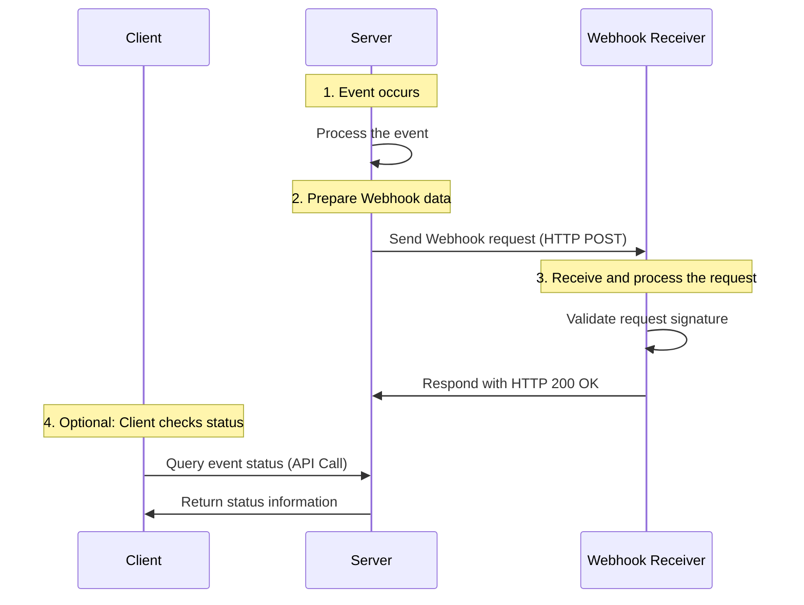
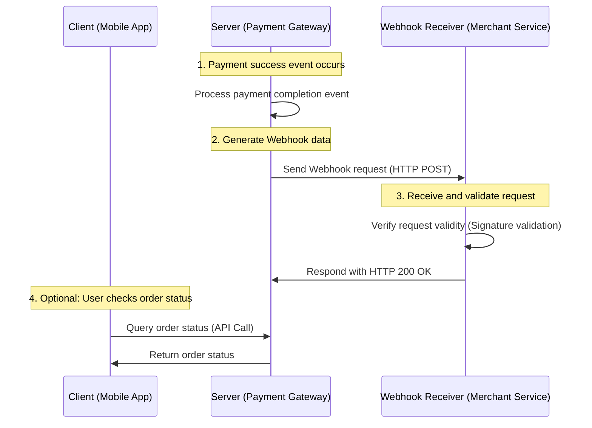

### Webhook Workflow

Below is a sequence diagram illustrating a Webhook workflow:



### Step-by-Step Workflow

1. **Event Occurs**: When a specific event (e.g., payment successful) is triggered within the system, the server starts processing it.
2. **Prepare Webhook Data**: The server prepares the relevant event data, including event type and details, for sending to the client’s Webhook URL.
3. **Send Webhook Request**: The server sends the data as an HTTP POST request to the Webhook receiver.
4. **Receive and Process Request**: The Webhook receiver validates the incoming request (e.g., checks the signature) and processes the event data. It then responds with an HTTP 200 OK to acknowledge successful receipt.
5. **Optional: Client Checks Status**: If the client does not receive the Webhook or wants additional confirmation, it can query the event status using an API.

---

#### **Explanation of Mermaid Diagram**

- **Participants**: Defined using `participant` for the entities involved, such as the client, server, and Webhook receiver.
- **Annotations**: `Note over` provides clear descriptions and flow step numbers.
- **Message Flow**: `->>` represents the direction of requests or responses in the workflow.

This visual representation makes it easier to understand the interaction between the server, client, and Webhook receiver during the Webhook lifecycle.

---

Below is the **Webhook Workflow**:



---

### **Detailed Steps**

#### Example Scenario
- **Client**: A mobile shopping application where users can view and manage their orders.
- **Server**: A payment gateway that processes payments and triggers notifications for order updates.
- **Webhook Receiver**: A merchant’s backend service that receives Webhook notifications from the payment gateway and updates the order status.

---

#### **Numbered Workflow**

1. **Payment Success Event Occurs**:
   - The user completes the payment via the mobile app.
   - The payment gateway detects a successful payment event.

2. **Generate Webhook Data**:
   - The payment gateway processes the event and generates Webhook data (e.g., order ID, payment status).

3. **Send Webhook Request**:
   - The payment gateway sends an HTTP POST request to the Webhook Receiver's URL, including the event data.

4. **Receive and Validate Request**:
   - The merchant service receives the Webhook request.
   - It validates the request's authenticity, such as verifying the signature, processes the data, and updates the order status.
   - It responds with an HTTP 200 OK to confirm successful receipt.

5. **Optional: User Checks Order Status**:
   - If the Webhook is delayed or the user wants to verify the order status, the client can query the payment gateway via an API call.
   - The payment gateway returns the current order status to the client.

---

### **Benefits**

This workflow illustrates an **event-driven communication model** where:
- The payment gateway (server) proactively notifies the merchant system (Webhook Receiver), reducing the need for constant polling.
- Real-time updates improve the user experience and system efficiency.

This diagram visually explains the interactions between components during a Webhook notification process.

---

Here’s the **C# code implementation** with **line-by-line explanations inside the code**:

---

### **C# Code with Embedded Explanations**

```csharp
// Import necessary namespaces for HTTP operations and JSON serialization
using System;
using System.Net.Http;
using System.Text.Json;
using System.Threading.Tasks;
using Microsoft.AspNetCore.Mvc;

// Simulating the Server (Payment Gateway) that sends Webhooks
public class Server
{
    private static readonly HttpClient HttpClient = new HttpClient(); // Initialize reusable HttpClient for sending HTTP requests

    public async Task SendWebhookAsync(string webhookUrl, WebhookPayload payload)
    {
        try
        {
            Console.WriteLine("1. Generating Webhook data..."); // Log the start of Webhook data generation
            string jsonData = JsonSerializer.Serialize(payload); // Serialize payload into JSON format

            Console.WriteLine("2. Sending Webhook to Merchant..."); // Log the Webhook sending process
            var content = new StringContent(jsonData, System.Text.Encoding.UTF8, "application/json"); // Prepare HTTP POST content with JSON data

            HttpResponseMessage response = await HttpClient.PostAsync(webhookUrl, content); // Send HTTP POST request to the Webhook URL
            
            // Check if the response indicates a successful delivery
            if (response.IsSuccessStatusCode)
                Console.WriteLine("3. Webhook delivered successfully!"); // Log success
            else
                Console.WriteLine($"Failed to deliver Webhook. Status Code: {response.StatusCode}"); // Log failure with status code
        }
        catch (Exception ex)
        {
            // Log any exceptions that occur during the Webhook sending process
            Console.WriteLine($"Error sending Webhook: {ex.Message}");
        }
    }
}

// Simulating the Webhook Receiver (Merchant Service) that processes incoming Webhooks
[ApiController]
[Route("api/[controller]")] // Define route as "/api/WebhookReceiver"
public class WebhookReceiverController : ControllerBase
{
    [HttpPost] // Specify this endpoint handles HTTP POST requests
    public IActionResult ReceiveWebhook([FromBody] WebhookPayload payload)
    {
        Console.WriteLine("4. Webhook received by Merchant Service..."); // Log that the Webhook has been received
        
        // Validate the Webhook signature to ensure it is from a trusted source
        if (!ValidateSignature(payload))
        {
            Console.WriteLine("Invalid Webhook signature."); // Log invalid signature
            return BadRequest("Invalid signature"); // Return HTTP 400 Bad Request
        }

        // Process the received Webhook event
        Console.WriteLine($"5. Processing Webhook Event: {payload.EventType}"); // Log the event type being processed
        return Ok(new { Message = "Webhook processed successfully" }); // Return HTTP 200 OK with success message
    }

    private bool ValidateSignature(WebhookPayload payload)
    {
        // Placeholder for signature validation logic (e.g., HMAC or token verification)
        return true; // Assume validation passes for simplicity
    }
}

// Define the structure of the Webhook payload
public class WebhookPayload
{
    public string EventType { get; set; } // The type of event, e.g., "PaymentSuccess"
    public string OrderId { get; set; } // The order ID associated with the event
    public decimal Amount { get; set; } // The amount involved in the event
}
```

---

### Key Explanations Inside Code:

1. **Server**:
   - The `SendWebhookAsync` method:
     - Serializes the payload into JSON.
     - Sends the Webhook to the merchant's Webhook endpoint.
     - Logs whether the Webhook delivery was successful or failed.

2. **Webhook Receiver**:
   - The `ReceiveWebhook` method:
     - Receives the Webhook payload and validates its authenticity.
     - Processes the Webhook event and logs the event type.
     - Returns an appropriate HTTP response.

3. **Payload Class**:
   - Defines the structure of the Webhook data, ensuring both sender and receiver understand the data format.

By embedding explanations within the code itself, each line or block directly clarifies its purpose and role in the Webhook workflow.

