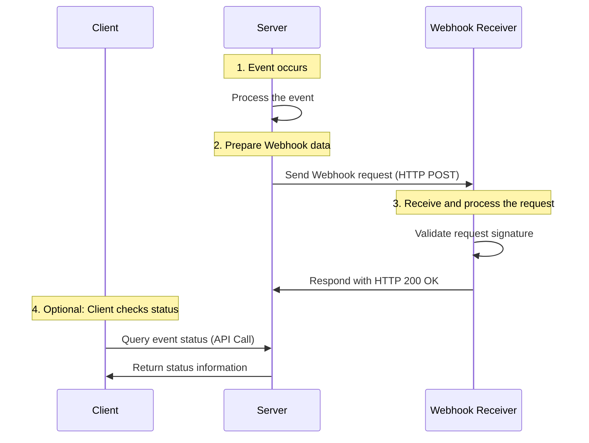

### Webhook Workflow

Below is a sequence diagram illustrating a Webhook workflow:

### Step-by-Step Workflow

1. **Event Occurs**: When a specific event (e.g., payment successful) is triggered within the system, the server starts processing it.
2. **Prepare Webhook Data**: The server prepares the relevant event data, including event type and details, for sending to the client’s Webhook URL.
3. **Send Webhook Request**: The server sends the data as an HTTP POST request to the Webhook receiver.
4. **Receive and Process Request**: The Webhook receiver validates the incoming request (e.g., checks the signature) and processes the event data. It then responds with an HTTP 200 OK to acknowledge successful receipt.
5. **Optional: Client Checks Status**: If the client does not receive the Webhook or wants additional confirmation, it can query the event status using an API.

---

#### **Explanation of Mermaid Diagram**

- **Participants**: Defined using `participant` for the entities involved, such as the client, server, and Webhook receiver.
- **Annotations**: `Note over` provides clear descriptions and flow step numbers.
- **Message Flow**: `->>` represents the direction of requests or responses in the workflow.

This visual representation makes it easier to understand the interaction between the server, client, and Webhook receiver during the Webhook lifecycle.
