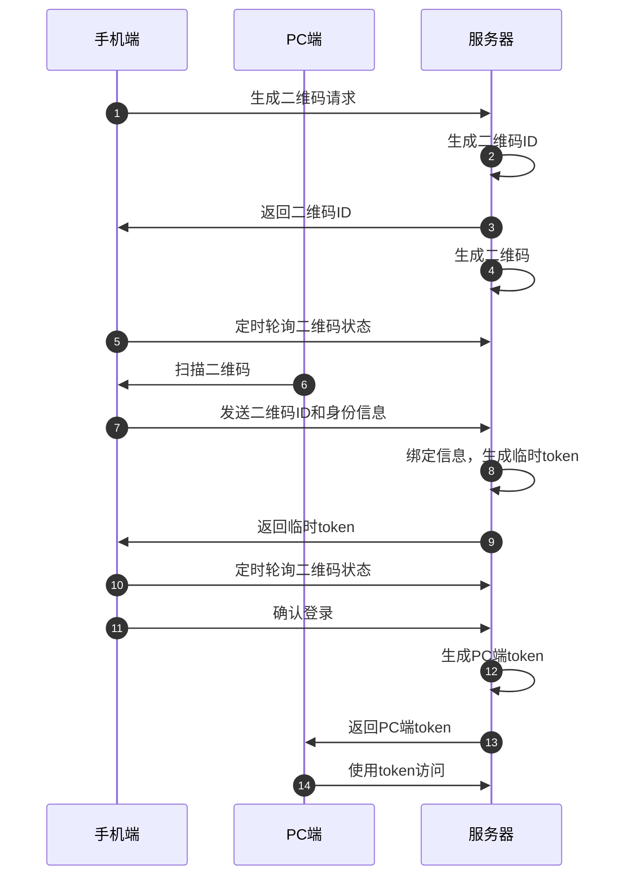
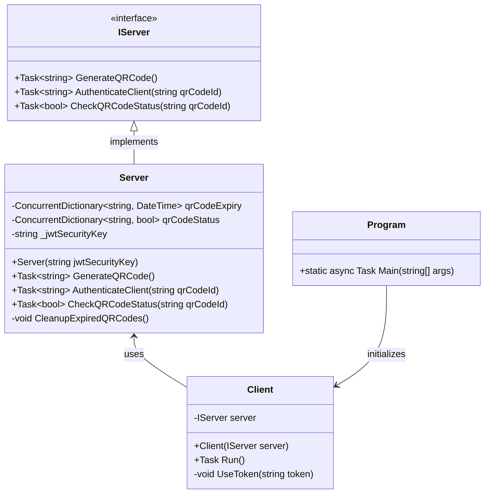

### 二维码登录流程




**流程详细说明：**

1. **生成二维码请求：** 手机端向服务器发起请求，要求生成一个二维码。
2. **生成二维码 ID：** 服务器生成一个唯一的二维码 ID，用于标识这个二维码。
3. **返回二维码 ID：** 服务器将生成的二维码 ID 返回给手机端。
4. **生成二维码：** 服务器根据二维码 ID 生成对应的二维码图片。
5. **定时轮询：** 手机端定时向服务器发送请求，查询二维码的扫码状态，直到登录成功。
6. **扫码二维码：** 用户使用其他设备（如 PC 端）扫描手机端的二维码。
7. **获取二维码 ID 和身份信息：** 手机端获取到被扫描的二维码 ID，并将自己的身份信息（token）发送给服务器。
8. **绑定信息和生成临时 token：** 服务器将二维码 ID 与手机端的身份信息绑定，生成一个临时的 token，并更新二维码状态为已扫码。
9. **返回临时 token：** 服务器将生成的临时 token 返回给手机端。
10. **轮询二维码状态：** 手机端继续定时轮询二维码状态，直到状态变为已确认。
11. **确认登录：** 手机端携带临时 token 向服务器发送确认登录请求。
12. **生成 PC 端 token：** 服务器为 PC 端生成一个 token，并更新二维码状态为已确认。
13. **返回 PC 端 token：** 服务器将生成的 PC 端 token 返回给 PC 端。
14. **使用 token 访问：** PC 端使用收到的 token 访问服务器，完成登录。

---

```C#
using System;
using System.Collections.Concurrent;
using System.Threading.Tasks;
using Microsoft.IdentityModel.Tokens;
using System.IdentityModel.Tokens.Jwt;
using System.Security.Claims;
using System.Text;

namespace QRCodeAuthentication
{
    // 定义接口IServer，方便对Server类进行扩展和依赖注入
    public interface IServer
    {
        // 定义生成二维码的方法
        Task<string> GenerateQRCode();
        
        // 定义验证客户端身份并生成Token的方法
        Task<string> AuthenticateClient(string qrCodeId);
        
        // 定义检查二维码扫描状态的方法
        Task<bool> CheckQRCodeStatus(string qrCodeId);
    }

    // 实现Server类，提供二维码生成、验证和清理功能
    public class Server : IServer
    {
        // 并发字典，用于存储二维码的到期时间
        private readonly ConcurrentDictionary<string, DateTime> qrCodeExpiry = new ConcurrentDictionary<string, DateTime>();
        
        // 并发字典，用于存储二维码是否已被扫描的状态
        private readonly ConcurrentDictionary<string, bool> qrCodeStatus = new ConcurrentDictionary<string, bool>();

        // JWT秘钥，用于生成安全的Token
        private readonly string _jwtSecurityKey;

        // 构造函数，初始化Server类并启动定时清理任务
        public Server(string jwtSecurityKey)
        {
            // 检查秘钥是否为空
            _jwtSecurityKey = jwtSecurityKey ?? throw new ArgumentNullException(nameof(jwtSecurityKey));

            // 启动异步任务，定期清理过期的二维码
            Task.Run(async () =>
            {
                while (true)
                {
                    CleanupExpiredQRCodes(); // 清理过期二维码
                    await Task.Delay(TimeSpan.FromMinutes(1)); // 每分钟执行一次
                }
            });
        }

        // 生成二维码并返回其唯一ID
        public async Task<string> GenerateQRCode()
        {
            string qrCodeId = Guid.NewGuid().ToString(); // 生成唯一ID
            qrCodeExpiry[qrCodeId] = DateTime.Now.AddMinutes(5); // 设置二维码5分钟后过期
            qrCodeStatus[qrCodeId] = false; // 初始状态设置为未扫描

            Console.WriteLine($"Server: Generated QR code ID: {qrCodeId}");
            return qrCodeId; // 返回二维码ID
        }

        // 验证客户端身份并生成JWT Token
        public async Task<string> AuthenticateClient(string qrCodeId)
        {
            // 检查二维码是否存在且未过期
            if (!qrCodeExpiry.ContainsKey(qrCodeId) || qrCodeExpiry[qrCodeId] < DateTime.Now)
            {
                throw new Exception("QR code expired or invalid."); // 抛出异常
            }

            // 检查二维码是否已被使用
            if (qrCodeStatus[qrCodeId])
            {
                throw new Exception("QR code already used."); // 抛出异常
            }

            qrCodeStatus[qrCodeId] = true; // 设置二维码为已扫描状态

            // 使用JWT生成Token
            var tokenHandler = new JwtSecurityTokenHandler();
            var key = Encoding.ASCII.GetBytes(_jwtSecurityKey); // 将秘钥转换为字节数组
            var tokenDescriptor = new SecurityTokenDescriptor
            {
                Subject = new ClaimsIdentity(new Claim[]
                {
                    new Claim(ClaimTypes.NameIdentifier, qrCodeId), // 将二维码ID作为Claim
                    new Claim("IssuedAt", DateTime.UtcNow.ToString("o")) // 添加自定义声明
                }),
                Expires = DateTime.UtcNow.AddMinutes(30), // 设置Token过期时间为30分钟
                SigningCredentials = new SigningCredentials(new SymmetricSecurityKey(key), SecurityAlgorithms.HmacSha256Signature) // 使用HMAC-SHA256签名
            };
            var token = tokenHandler.CreateToken(tokenDescriptor); // 创建Token
            var tokenString = tokenHandler.WriteToken(token); // 转换为字符串形式

            Console.WriteLine($"Server: Authenticated client and generated token: {tokenString}");
            return tokenString; // 返回生成的Token
        }

        // 检查二维码是否已被扫描
        public async Task<bool> CheckQRCodeStatus(string qrCodeId)
        {
            return qrCodeStatus.TryGetValue(qrCodeId, out var status) && status; // 返回二维码状态
        }

        // 清理过期的二维码
        private void CleanupExpiredQRCodes()
        {
            foreach (var key in qrCodeExpiry.Keys)
            {
                if (qrCodeExpiry[key] < DateTime.Now) // 检查是否过期
                {
                    qrCodeExpiry.TryRemove(key, out _); // 从字典中移除
                    qrCodeStatus.TryRemove(key, out _); // 同时移除状态
                }
            }
        }
    }

    // 客户端类，模拟二维码扫描和验证Token
    public class Client
    {
        private readonly IServer server;

        // 构造函数，通过依赖注入传入Server对象
        public Client(IServer server)
        {
            this.server = server;
        }

        // 模拟客户端运行流程
        public async Task Run()
        {
            try
            {
                // 生成二维码
                string qrCodeId = await server.GenerateQRCode();
                Console.WriteLine($"Client: Received QR code ID: {qrCodeId}");

                // 模拟轮询检查二维码状态
                bool isScanned = false;
                while (!isScanned)
                {
                    isScanned = await server.CheckQRCodeStatus(qrCodeId);
                    await Task.Delay(1000); // 每秒轮询一次
                }

                // 获取Token
                string token = await server.AuthenticateClient(qrCodeId);
                Console.WriteLine($"Client: Received token: {token}");

                // 使用Token访问资源
                UseToken(token);
            }
            catch (Exception ex)
            {
                Console.WriteLine($"Client: Error - {ex.Message}"); // 捕获异常并输出错误信息
            }
        }

        // 使用Token访问资源
        private void UseToken(string token)
        {
            Console.WriteLine($"Client: Using token to access resources: {token}");
            // 实际资源访问逻辑可在此处实现
        }
    }

    // 程序主入口
    public class Program
    {
        public static async Task Main(string[] args)
        {
            IServer server = new Server("your_secret_key"); // 初始化服务端并传入JWT秘钥
            Client client = new Client(server); // 初始化客户端
            await client.Run(); // 运行客户端逻辑
        }
    }
}
```



1. **`IServer` 接口**
   - 这是服务端功能的抽象定义，提供以下三个方法：
     - `GenerateQRCode()`: 生成二维码并返回唯一标识。
     - `AuthenticateClient(string qrCodeId)`: 验证客户端并生成令牌。
     - `CheckQRCodeStatus(string qrCodeId)`: 检查二维码是否已被扫描。

2. **`Server` 类**
   - 实现了 `IServer` 接口，具体提供了二维码生成和认证逻辑。
   - 主要成员：
     - **私有字段**：
       - `qrCodeExpiry`：并发字典，用于存储二维码及其到期时间。
       - `qrCodeStatus`：并发字典，用于记录二维码的扫描状态。
       - `_jwtSecurityKey`：用于生成 JWT 的秘钥。
     - **公开方法**：
       - `GenerateQRCode()`：生成二维码并存储其状态。
       - `AuthenticateClient(string qrCodeId)`：验证二维码有效性并生成安全的 JWT。
       - `CheckQRCodeStatus(string qrCodeId)`：返回二维码是否已被扫描。
     - **私有方法**：
       - `CleanupExpiredQRCodes()`：清理过期的二维码，释放资源。

3. **`Client` 类**
   - 模拟客户端行为，依赖 `IServer` 接口。
   - 主要成员：
     - **私有字段**：
       - `server`：服务端接口的引用。
     - **方法**：
       - `Run()`：客户端的主流程，模拟生成二维码、检查状态、获取令牌及访问资源。
       - `UseToken(string token)`：模拟使用令牌访问资源。

4. **`Program` 类**
   - 程序入口，负责初始化 `Server` 和 `Client` 对象，并启动客户端运行逻辑。


#### **设计分析**
1. **接口分离**
   - `IServer` 提供了标准接口，方便实现不同的服务端逻辑。
   - 客户端通过接口依赖 `Server`，提高了代码的扩展性和可维护性。

2. **职责清晰**
   - 服务端负责二维码的生成、认证及过期清理。
   - 客户端负责模拟用户的扫描及令牌的使用。

3. **并发安全**
   - 使用 `ConcurrentDictionary` 确保二维码状态的线程安全性，适合高并发场景。

4. **安全性**
   - 使用 `JWT` 生成安全令牌，令牌包含自定义声明（如二维码ID和时间戳），保证了身份验证的安全性和扩展性。

此类图和分析展示了整个系统的核心逻辑和实现细节，便于开发和维护人员快速理解系统结构。
