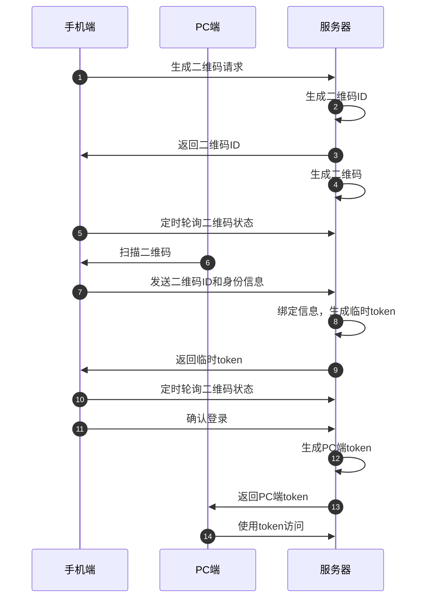

### 二维码登录流程

**流程详细说明：**

1. **生成二维码请求：** 手机端向服务器发起请求，要求生成一个二维码。
2. **生成二维码 ID：** 服务器生成一个唯一的二维码 ID，用于标识这个二维码。
3. **返回二维码 ID：** 服务器将生成的二维码 ID 返回给手机端。
4. **生成二维码：** 服务器根据二维码 ID 生成对应的二维码图片。
5. **定时轮询：** 手机端定时向服务器发送请求，查询二维码的扫码状态，直到登录成功。
6. **扫码二维码：** 用户使用其他设备（如 PC 端）扫描手机端的二维码。
7. **获取二维码 ID 和身份信息：** 手机端获取到被扫描的二维码 ID，并将自己的身份信息（token）发送给服务器。
8. **绑定信息和生成临时 token：** 服务器将二维码 ID 与手机端的身份信息绑定，生成一个临时的 token，并更新二维码状态为已扫码。
9. **返回临时 token：** 服务器将生成的临时 token 返回给手机端。
10. **轮询二维码状态：** 手机端继续定时轮询二维码状态，直到状态变为已确认。
11. **确认登录：** 手机端携带临时 token 向服务器发送确认登录请求。
12. **生成 PC 端 token：** 服务器为 PC 端生成一个 token，并更新二维码状态为已确认。
13. **返回 PC 端 token：** 服务器将生成的 PC 端 token 返回给 PC 端。
14. **使用 token 访问：** PC 端使用收到的 token 访问服务器，完成登录。
