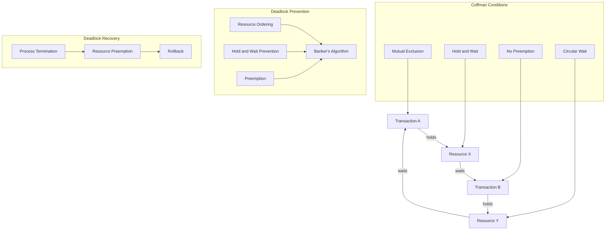

### What is a Deadlock?

A deadlock occurs when two or more transactions are waiting for each other to release locks on resources they need to continue processing. This results in a situation where neither transaction can proceed, and they end up waiting indefinitely.

#### Coffman Conditions
The Coffman conditions, named after Edward G. Coffman Jr., who first outlined them in 1971, are necessary for a deadlock to occur:

1. **Mutual Exclusion**: At least one resource must be held in a non-shareable mode.
2. **Hold and Wait**: A process is currently holding at least one resource and requesting additional resources that are being held by other processes.
3. **No Preemption**: Resources cannot be forcibly removed from the processes holding them.
4. **Circular Wait**: There exists a set of processes waiting for resources held by others, forming a circular chain.

#### Deadlock Prevention
To prevent deadlocks, we can use several strategies:

1. **Resource Ordering**: Each process requests resources in a strictly increasing order.
2. **Hold and Wait Prevention**: Ensure that a process holding resources must release them before requesting additional resources.
3. **Preemption**: Allow the system to preempt resources from a process.
4. **Banker's Algorithm**: A deadlock avoidance algorithm that simulates resource allocation to ensure safe states.

#### Deadlock Recovery
If a deadlock occurs, the system can recover using these methods:

1. **Process Termination**: Terminate one or more processes to break the circular wait.
2. **Resource Preemption**: Preempt some resources from processes and allocate them to others.
3. **Rollback**: Rollback one or more processes to their previous states.

### Markdown Diagram



### Node.js Example of Deadlock Detection

This Node.js example simulates deadlock detection and prevention in a simplified manner:

```javascript
class Resource {
    constructor(name) {
        this.name = name;
        this.lockedBy = null;
    }

    lock(transaction) {
        if (this.lockedBy === null) {
            this.lockedBy = transaction;
            console.log(`${transaction.name} locked ${this.name}`);
            return true;
        }
        console.log(`${transaction.name} waiting for ${this.name}`);
        return false;
    }

    unlock() {
        console.log(`${this.lockedBy.name} released ${this.name}`);
        this.lockedBy = null;
    }
}

class Transaction {
    constructor(name) {
        this.name = name;
    }

    request(resources) {
        for (let resource of resources) {
            if (!resource.lock(this)) {
                return false;
            }
        }
        return true;
    }

    release(resources) {
        for (let resource of resources) {
            resource.unlock();
        }
    }
}

const resourceX = new Resource('Resource X');
const resourceY = new Resource('Resource Y');

const transactionA = new Transaction('Transaction A');
const transactionB = new Transaction('Transaction B');

// Transaction A locks Resource X
transactionA.request([resourceX]);

// Transaction B locks Resource Y
transactionB.request([resourceY]);

// Deadlock situation
if (!transactionA.request([resourceY])) {
    console.log('Deadlock detected! Transaction A waiting for Resource Y');
}

if (!transactionB.request([resourceX])) {
    console.log('Deadlock detected! Transaction B waiting for Resource X');
}

// Resolve deadlock by releasing resources
transactionA.release([resourceX]);
transactionB.release([resourceY]);
```

This script simulates resource locking and deadlock detection. It illustrates how transactions can end up in a deadlock and how the system can detect and resolve it by releasing resources.
