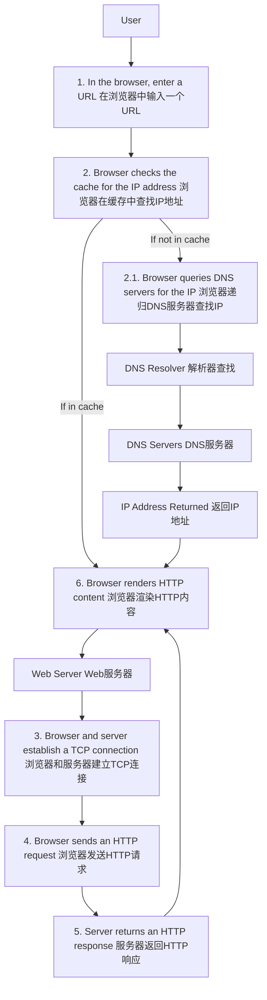

### From URL to Webpage: What Happens in Between? 从网址到网页：中间发生了什么？

### Detailed Steps (详细步骤)

1. **User Enters URL (用户输入URL)**
    - The user types a URL into the browser's address bar.
    - 用户在浏览器的地址栏中输入一个URL。

2. **Cache Check (缓存检查)**
    - The browser first checks its cache to see if it already has the IP address for the URL.
    - 浏览器首先检查其缓存，查看是否已有URL的IP地址。

3. **DNS Query (DNS查询)**
    - If the IP address is not in the cache, the browser sends a DNS query to resolve the domain name to an IP address.
    - 如果IP地址不在缓存中，浏览器会发送DNS查询以将域名解析为IP地址。

4. **TCP Connection (TCP连接)**
    - The browser and the web server establish a TCP connection.
    - 浏览器和Web服务器建立TCP连接。

5. **HTTP Request (HTTP请求)**
    - The browser sends an HTTP request to the web server.
    - 浏览器向Web服务器发送HTTP请求。

6. **HTTP Response (HTTP响应)**
    - The web server processes the request and sends back an HTTP response with the requested content.
    - Web服务器处理请求，并发送包含请求内容的HTTP响应。

7. **Rendering (渲染)**
    - The browser renders the content and displays it to the user.
    - 浏览器渲染内容并将其显示给用户。

This process involves multiple steps to resolve the domain name, establish a connection, and finally render the content, ensuring that the user can view the requested webpage.

这个过程涉及多个步骤来解析域名、建立连接，最后渲染内容，确保用户可以查看所请求的网页。
