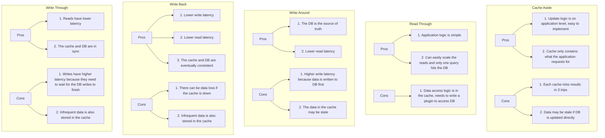

### Top 5 Caching Strategies 顶级5种缓存策略

### Detailed Explanation (详细解释)

#### Cache Aside (旁路缓存)
**Pros:**
1. Update logic is on application level, easy to implement.
2. Cache only contains what the application requests for.

**优点:**
1. 更新逻辑在应用层，易于实现。
2. 缓存只包含应用程序请求的数据。

**Cons:**
1. Each cache miss results in 3 trips.
2. Data may be stale if DB is updated directly.

**缺点:**
1. 每次缓存未命中会导致三次往返。
2. 如果数据库直接更新，缓存中的数据可能会过时。

#### Read Through (读取穿透)
**Pros:**
1. Application logic is simple.
2. Can easily scale the reads and only one query hits the DB.

**优点:**
1. 应用逻辑简单。
2. 可以轻松扩展读取操作，并且只有一个查询命中数据库。

**Cons:**
1. Data access logic is in the cache, needs to write a plugin to access DB.

**缺点:**
1. 数据访问逻辑在缓存中，需要编写插件以访问数据库。

#### Write Around (写绕过)
**Pros:**
1. The DB is the source of truth.
2. Lower read latency.

**优点:**
1. 数据库是可信来源。
2. 较低的读取延迟。

**Cons:**
1. Higher write latency because data is written to DB first.
2. The data in the cache may be stale.

**缺点:**
1. 写延迟较高，因为数据首先写入数据库。
2. 缓存中的数据可能会过时。

#### Write Back (写回)
**Pros:**
1. Lower write latency.
2. Lower read latency.
3. The cache and DB are eventually consistent.

**优点:**
1. 较低的写延迟。
2. 较低的读取延迟。
3. 缓存和数据库最终一致。

**Cons:**
1. There can be data loss if the cache is down.
2. Infrequent data is also stored in the cache.

**缺点:**
1. 如果缓存出现故障，可能会有数据丢失。
2. 不频繁的数据也存储在缓存中。

#### Write Through (写穿透)
**Pros:**
1. Reads have lower latency.
2. The cache and DB are in sync.

**优点:**
1. 读取延迟较低。
2. 缓存和数据库同步。

**Cons:**
1. Writes have higher latency because they need to wait for the DB writes to finish.
2. Infrequent data is also stored in the cache.

**缺点:**
1. 写操作延迟较高，因为需要等待数据库写入完成。
2. 不频繁的数据也存储在缓存中。

These caching strategies help in optimizing the performance of applications by reducing latency and improving data access speed. By choosing the right caching strategy, developers can enhance the efficiency and scalability of their systems.

这些缓存策略通过减少延迟和提高数据访问速度来优化应用程序的性能。通过选择正确的缓存策略，开发人员可以提高系统的效率和可扩展性。
